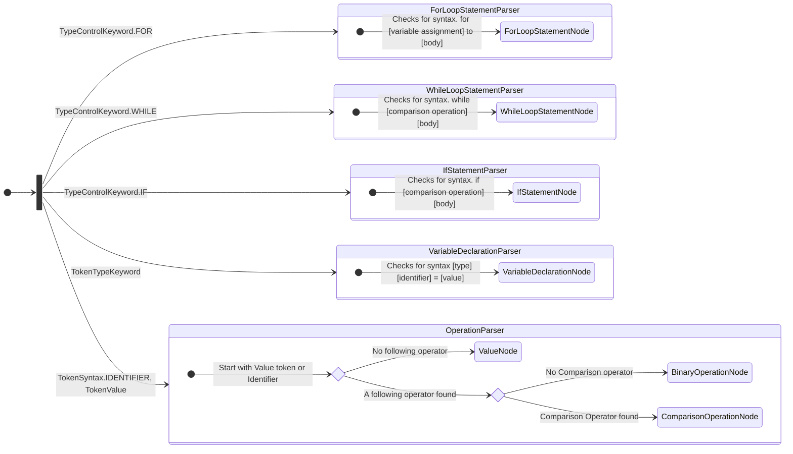

```mermaid
stateDiagram-v2
    direction LR
    state Fork <<fork>>
    [*] --> Fork

    Fork --> ForLoopStatementParser : TypeControlKeyword.FOR
    state ForLoopStatementParser {
        direction LR
        [*] --> ForLoopStatementNode : Checks for syntax. for [variable assignment] to [body]
    }

    Fork --> WhileLoopStatementParser : TypeControlKeyword.WHILE
    state WhileLoopStatementParser {
        direction LR
        [*] --> WhileLoopStatementNode : Checks for syntax. while [comparison operation] [body]
    }

    Fork --> IfStatementParser : TypeControlKeyword.IF
    state IfStatementParser {
        direction LR
        [*] --> IfStatementNode : Checks for syntax. if [comparison operation] [body]
    }

    Fork --> VariableDeclarationParser : TokenTypeKeyword
    state VariableDeclarationParser {
        direction LR
        [*] --> VariableDeclarationNode : Checks for syntax [type] [identifier] = [value]
    }
    
    Fork --> OperationParser : TokenSyntax.IDENTIFIER, TokenValue
    state OperationParser{
        direction LR
        state Operator <<choice>>
        [*] --> Operator : Start with Value token or Identifier
        Operator --> ValueNode : No following operator

        state DoubleOperator <<choice>>
        Operator --> DoubleOperator : A following operator found
        DoubleOperator --> BinaryOperationNode : No Comparison operator
        DoubleOperator --> ComparisonOperationNode : Comparison Operator found
    }
```