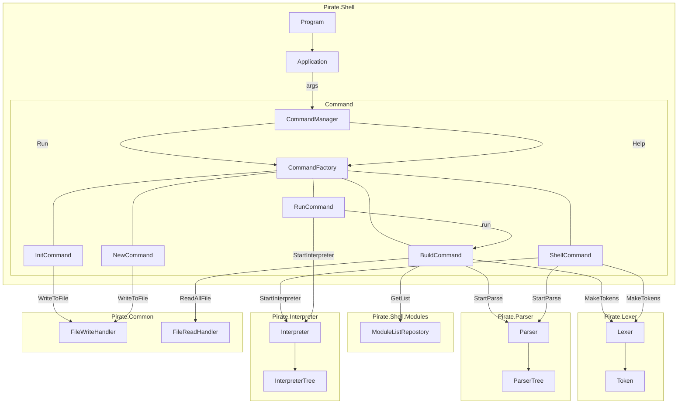

```mermaid
flowchart TD
    subgraph Pirate.Shell
        Program --> Application
        Application -- args --> CommandManager

        subgraph Command
            CommandManager --Run--> CommandFactory 
            CommandManager --Help--> CommandFactory 
            
            CommandFactory --- RunCommand
            CommandFactory --- BuildCommand
            CommandFactory --- ShellCommand
            CommandFactory --- InitCommand
            CommandFactory --- NewCommand
            
            
            RunCommand -- run --> BuildCommand

        end        
    end
    
    subgraph Pirate.Shell.Modules
        BuildCommand --GetList--> ModuleListRepostory
    end

    subgraph Pirate.Lexer
        BuildCommand --MakeTokens--> Lexer
        ShellCommand --MakeTokens--> Lexer

        Lexer --> Token
    end

    subgraph Pirate.Parser
        BuildCommand --StartParse--> Parser
        ShellCommand --StartParse--> Parser

        Parser --> ParserTree
    end

    subgraph Pirate.Interpreter
        ShellCommand --StartInterpreter--> Interpreter
        RunCommand --StartInterpreter--> Interpreter

        Interpreter --> InterpreterTree
    end

    subgraph Pirate.Common
        InitCommand --WriteToFile--> FileWriteHandler
        NewCommand --WriteToFile--> FileWriteHandler
        BuildCommand --ReadAllFile--> FileReadHandler
    end

```